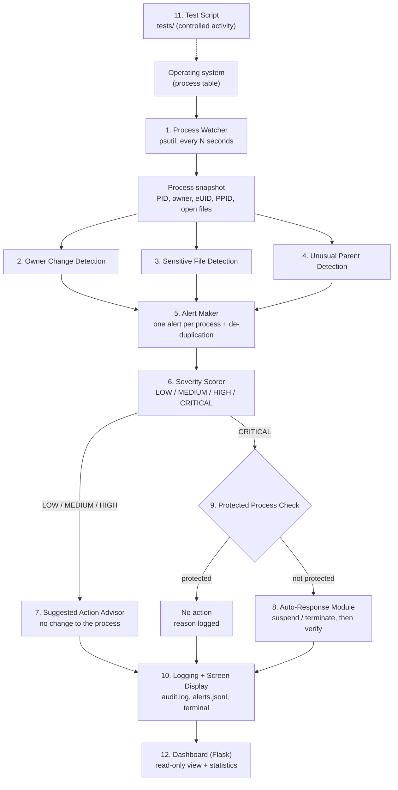

# Architecture

The auditor is a polling pipeline. Every few seconds it reads the operating
system's process table, runs three independent checks on it, turns the
findings into alerts, rates each alert, and then either suggests an action or
(for Critical alerts only) performs a controlled response. Everything is
logged. The dashboard is a separate program that only reads the log files.

## Pipeline



The same pipeline as plain text:

```
Operating System
      |
Process Watcher  ---------------->  Process Snapshot
      |
      +--> Owner Change Detection ----+
      +--> Sensitive File Detection --+--> Alert Maker --> Severity Scorer
      +--> Unusual Parent Detection --+                          |
                                                                 |
                      LOW / MEDIUM / HIGH  <---------------------+---------------------> CRITICAL
                             |                                                               |
                 Suggested Action Advisor                                       Protected Process Check
                 (no change is made)                                            |                     |
                             |                                              protected           not protected
                             |                                           (no action, why)     Auto-Response Module
                             |                                                  |             (suspend / terminate)
                             +-------------------> Logging + Screen Display <---+---------------------+
                                                             |
                                                  Dashboard / Statistics (read-only)
```

## Module to file map

| # | Module (Review 2 name) | File | Input | Output |
|---|---|---|---|---|
| 1 | Process Watcher | `src/process_watcher.py` | OS process table (psutil) | `Snapshot` of `ProcessRecord`s |
| 2 | Owner Change Detection | `src/owner_detector.py` | snapshot + baseline table | owner-change `Finding`s |
| 3 | Sensitive File Detection | `src/sensitive_file_detector.py` | open files + watchlist | sensitive-file `Finding`s |
| 4 | Unusual Parent Process Detection | `src/parent_detector.py` | PID / PPID pairs + rules | unusual-parent `Finding`s |
| 5 | Alert Maker | `src/alert_maker.py` | findings | one `Alert` per process, duplicates removed |
| 6 | Severity Scorer | `src/severity_scorer.py` | alert | alert + severity |
| 7 | Suggested Action Advisor | `src/action_advisor.py` | Low / Medium / High alert | suggestion text |
| 8 | Auto-Response Module | `src/auto_response.py` | Critical alert | action taken + verified result |
| 9 | Protected Process List | `src/protected_processes.py` | PID + name | protected / not protected + reason |
| 10 | Logging / Screen Display | `src/audit_logger.py` | every alert | `logs/audit.log`, `logs/alerts.jsonl`, terminal |
| 11 | Test Script | `tests/` | scenario A-F | controlled activity + results table |
| 12 | Dashboard + statistics | `src/dashboard.py`, `templates/`, `static/` | log + status files | web page |

`src/main.py` wires modules 1-10 together in `Auditor.run_cycle()`.
`src/models.py` holds the records passed between modules.
`src/config.py` loads the files in `config/`.
`src/test_hooks.py` is the clearly separated test-injection hook (see `docs/testing.md`).

## One polling cycle, step by step

1. **Identify running processes** - `psutil.process_iter()`.
2. **Collect process information** - PID, name, owner, real and effective UID,
   parent PID, command line, open files, CPU, memory, creation time. A process
   that exits mid-read, a zombie, or an attribute macOS refuses to give is
   skipped without stopping the cycle.
3. **Compare with the defined conditions**
   - owner: compare with the baseline stored the first time the PID was seen;
   - files: compare each open path with the watchlist;
   - parent: check the (parent name, child name) pair against the rules.
4. **Rule triggered?** If nothing is found the cycle ends here.
5. **Generate alert** - findings for the same PID are merged into one alert.
   The same behaviour by the same process is not reported again during the
   cooldown (`alert_cooldown_seconds`).
6. **Assign severity** - see the table below.
7. **Recommend action** (Low / Medium / High) - nothing is changed.
8. **Check protected list** (Critical).
9. **Apply permitted response** - suspend or terminate, or nothing if protected.
10. **Record in the log**, 11. **display on screen**.

## Severity rules

| Triggered rule(s) | Severity |
|---|---|
| Sensitive file tagged `low` in the watchlist | LOW |
| Unusual parent process on its own | MEDIUM |
| Sensitive file (default sensitivity) on its own | HIGH |
| Owner / permission change on its own | HIGH |
| Several rules, no Critical combination | highest of the individual levels |
| **Owner change + sensitive-file access in the same process** | **CRITICAL** |

## Design decisions worth knowing for the viva

- **Polling, not kernel tracing.** The watcher asks the OS every N seconds.
  Simple and portable, but activity shorter than one interval can be missed
  and detection can take up to one interval.
- **Baseline keyed by PID *and* creation time.** PIDs are reused by the OS.
  A baseline is replaced if the creation time differs and deleted when the
  PID disappears, so a new process is never compared with an old one's owner.
- **Owner means username plus effective UID.** The effective UID is the
  process's permission level (0 = root); a change of either is a finding.
- **Automatic action only at Critical.** A false Low/Medium/High alert costs
  the user a look; a false automatic kill costs them their work.
- **Protected check sits immediately before the action**, and is repeated on
  the live process, so no path reaches `suspend()` without passing it.
- **Suspend is the default response.** It is reversible (`SIGSTOP` /
  `SIGCONT`), unlike terminate.
- **Scope policy.** By default (`auto_response_scope: "test_only"`) only
  controlled test processes can be suspended. Critical alerts on real
  processes are logged with "response withheld" for the user to handle.
- **The dashboard is a separate process** that reads two files. If it
  crashes, monitoring is unaffected; it has no process-control buttons.
