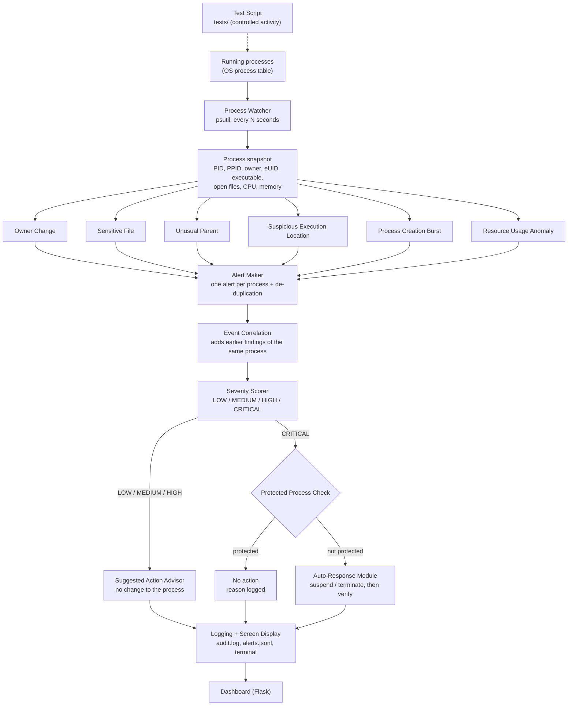

# Architecture

The auditor is a polling pipeline. Every few seconds it reads the operating
system's process table, runs six independent checks on it, turns the findings
into alerts, rates each alert, and then either suggests an action or (for
Critical alerts only) performs a controlled response. Everything is logged.
The dashboard is a separate program that reads the log files.

## Pipeline

## Module to file map

| Stage | Module | File | Input | Output |
|---|---|---|---|---|
| Collect | Process Watcher | `src/process_watcher.py` | OS process table (psutil) | `Snapshot` of `ProcessRecord`s |
| Detect | Owner Change | `src/owner_detector.py` | snapshot + baseline table | `Finding`s |
| Detect | Sensitive File | `src/sensitive_file_detector.py` | open files + watchlist | `Finding`s |
| Detect | Unusual Parent | `src/parent_detector.py` | PID / PPID pairs + rules | `Finding`s |
| Detect | Suspicious Execution Location | `src/exec_location_detector.py` | executable paths + folder list | `Finding`s |
| Detect | Process Creation Burst | `src/burst_detector.py` | PPID + creation times + history | `Finding`s (on the parent) |
| Detect | Resource Usage Anomaly | `src/resource_detector.py` | CPU % / memory % + streak counters | `Finding`s |
| Combine | Alert Maker | `src/alert_maker.py` | findings | one `Alert` per process |
| Combine | Alert De-duplication | `src/alert_deduplicator.py` | findings + cooldown table | new / repeat decision |
| Combine | Event Correlation | `src/event_correlation.py` | alert + recent findings | alert with earlier findings added |
| Decide | Severity Scorer | `src/severity_scorer.py` | alert | alert + severity |
| Respond | Suggested Action Advisor | `src/action_advisor.py` | Low / Medium / High alert | suggestion text |
| Respond | Protected Process List | `src/protected_processes.py` | PID + name | protected / not protected + reason |
| Respond | Auto-Response Module | `src/auto_response.py` | Critical alert | action taken + verified result |
| Record | Logging / Screen Display | `src/audit_logger.py` | every alert | `logs/audit.log`, `logs/alerts.jsonl`, terminal |
| Show | Dashboard | `src/dashboard.py`, `src/test_lab.py`, `templates/`, `static/` | log + status + config files | web pages |
| Test | Test Script | `tests/` | scenario A-J | controlled activity + results table |

`src/main.py` wires the pipeline together in `Auditor.run_cycle()`.
`src/models.py` holds the records passed between modules.
`src/config.py` loads the files in `config/`.
`src/test_hooks.py` is the clearly separated test-injection hook (see `testing.md`).

## One polling cycle, step by step

1. **Collect.** `psutil.process_iter()` lists the processes. For each one the
   watcher reads PID, name, owner, real and effective UID, parent PID, command
   line, executable path, open files, CPU %, memory and creation time. A
   process that exits mid-read, a zombie, or an attribute macOS refuses to
   give is skipped without stopping the cycle.
2. **Detect.** The six checks each look at the same snapshot and return
   findings (see below).
3. **Make alerts.** Findings for the same PID are merged into one alert. The
   de-duplicator drops the alert if none of its findings is new.
4. **Correlate.** The Event Correlator adds this process's findings from
   earlier polls that are still inside the correlation window.
5. **Score.** The Severity Scorer applies the fixed table.
6. **Respond.** Low / Medium / High → suggestion. Critical → protected check,
   scope check, PID-reuse check, protected check again on the live process,
   then suspend / terminate and read the state back from the OS.
7. **Record.** The alert is written to both log files and the terminal, and
   the status file for the dashboard is replaced.
8. **Remember.** The cycle's findings are handed to the Event Correlator for
   use in later cycles.

## How each detection works

| Check | State it keeps | Rule |
|---|---|---|
| Owner Change | `{PID: (owner, effective UID, creation time)}` | Stored on first sight; a later difference is a finding. A different creation time means the PID was reused → new baseline. Entries of exited PIDs are deleted. |
| Sensitive File | none (watchlist re-read when the file changes) | Any open-file path equal to a watchlist entry, or inside a watched directory. |
| Unusual Parent | none | The parent's name matches a rule's `parents` and the child's name matches its `children`. |
| Suspicious Execution Location | none | The executable path starts with a listed directory + `/`. Empty path (unreadable) → skipped. |
| Process Creation Burst | `{parent: {child PID: creation time}}` for children created within the window | A parent with ≥ threshold remembered children gets one finding per burst. Children are remembered even after they exit; entries older than the window are dropped. |
| Resource Usage Anomaly | `{process: consecutive polls above threshold}` | The counter goes up on a poll above the CPU or memory threshold and back to zero otherwise; reaching N raises one finding per episode. |

None of the checks starts a subprocess, scans the filesystem or uses the
network. On the development Mac a full cycle over about 500 processes takes
roughly 0.1 s.

## Severity rules

| Triggered rule(s) on one process | Severity |
|---|---|
| Sensitive file tagged `low` | LOW |
| Unusual parent / suspicious location / process burst / resource anomaly, alone | MEDIUM |
| Sensitive file alone | HIGH |
| Owner change alone | HIGH |
| Two or more different MEDIUM rules | HIGH |
| **Owner change + sensitive-file access** | **CRITICAL** |
| Anything else | highest of the individual levels |

## Event correlation and de-duplication

- **Same poll:** the Alert Maker groups findings by PID.
- **Across polls:** the Event Correlator keeps
  `{(PID, creation time): {rule: (finding, last seen)}}`. When a new alert is
  raised for a process, findings of *other* rules seen within
  `correlation_window_seconds` are added and marked "seen N s earlier". The
  Severity Scorer then sees the combined set.
- **De-duplication:** the key is `(PID, creation time, rule, object)`. An
  alert passes only if at least one key is new or has been absent for
  `alert_cooldown_seconds`. Seeing a key again restarts its cooldown, so a
  persistent condition is reported once.

## Dashboard

The dashboard is a separate Flask process. It reads `logs/auditor_state.json`
(written once per poll), `logs/alerts.jsonl` and the `config/` files, and
serves seven pages plus a small JSON API (`/api/status`, `/api/alerts`,
`/api/processes`, `/api/statistics`, `/api/test-lab`). It contains no
detection or response logic. If it crashes, monitoring is unaffected.

Its single write action is `POST /api/test-lab/run/<letter>`, which starts
`python -m tests.scenario_<letter>` for a letter in the fixed table in
`src/test_lab.py` (argument list, no shell; one at a time; local requests
carrying the dashboard's own header only; auditor must be in test mode).

## Design decisions worth knowing for the viva

- **Polling, not kernel tracing.** Simple and portable, but activity shorter
  than one interval can be missed and detection can take up to one interval.
- **Processes are identified by PID *and* creation time** everywhere (baseline,
  de-duplication, correlation, auto-response), because the OS reuses PIDs.
- **Owner means username plus effective UID.** The effective UID is the
  process's permission level (0 = root).
- **Rules, not learning.** Every alert can be traced to a configured value.
- **Automatic action only at Critical, and only one combination reaches
  Critical.** A false Low/Medium/High alert costs the user a look; a false
  automatic kill costs them their work.
- **The protected check sits immediately before the action**, and is repeated
  on the live process.
- **Suspend is the default response** because it is reversible.
- **Scope policy.** By default only controlled test processes can be
  suspended; Critical alerts on real processes are logged as "response
  withheld".
